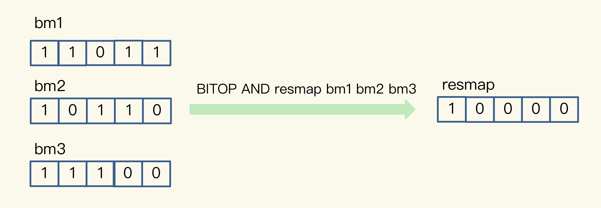
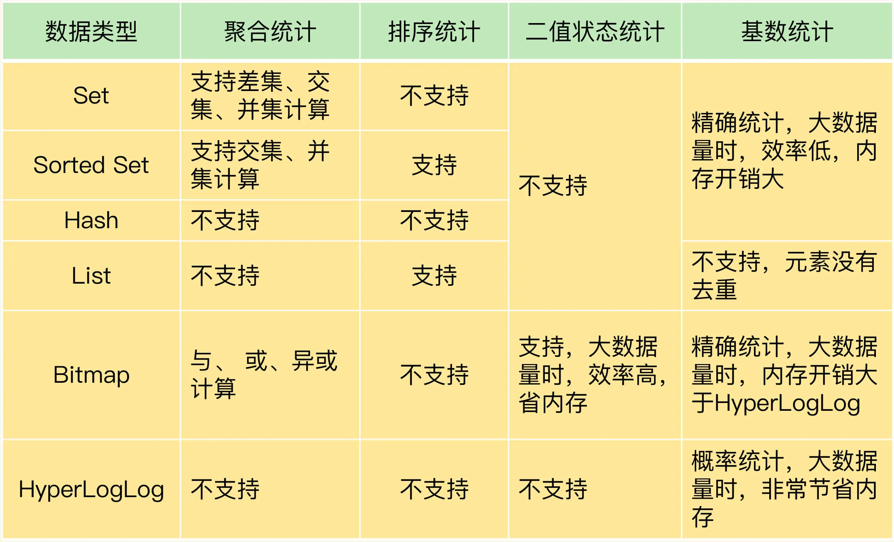

Redis 集合类型的特点就是一个键对应一系列的数据

在 Web 和移动应用的业务场景中，我们经常需要保存这样一种信息：一个 key 对应了一个数据集合，例如：
* 手机 App 中的每天的用户登录信息：一天对应一系列用户 ID 或移动设备 ID；
* 电商网站上商品的用户评论列表：一个商品对应了一系列的评论；
* 用户在手机 App 上的签到打卡信息：
* 一天对应一系列用户的签到记录；应用网站上的网页访问信息：一个网页对应一系列的访问点击。

集合类型常见的有四种统计模式：
* 聚合统计
* 排序统计
* 二值状态统计
* 基数统计

# 聚合统计
在刚才提到的场景中，统计手机 App 每天的新增用户数和第二天的留存用户数，正好对应了聚合统计！

所谓的聚合统计，就是指统计多个集合元素的聚合结果，包括：

* 统计多个集合的共有元素（交集统计）；

`SINTERSTORE user:id:rem user:id:20200803 user:id:20200804`
  
* 把两个集合相比，统计其中一个集合独有的元素（差集统计）；

`SDIFFSTORE  user:new  user:id:20200804 user:id  `

* 统计多个集合的所有元素（并集统计）。

`SUNIONSTORE  user:id  user:id  user:id:20200803 `


**Set 的差集、并集和交集的计算复杂度较高，在数据量较大的情况下，如果直接执行这些计算，会导致 Redis 实例阻塞。所以，我给你分享一个小建议：你可以从主从集群中选择一个从库，让它专门负责聚合计算，或者是把数据读取到客户端，在客户端来完成聚合统计，这样就可以规避阻塞主库实例和其他从库实例的风险了。**
**“Set数据类型，使用SUNIONSTORE、SDIFFSTORE、SINTERSTORE做并集、差集、交集时，选择一个从库进行聚合计算”。这3个命令都会在Redis中生成一个新key，而从库默认是readonly不可写的，所以这些命令只能在主库使用。想在从库上操作，可以使用SUNION、SDIFF、SINTER，这些命令可以计算出结果，但不会生成新key。**

# 排序统计
比如最新评论列表包含了所有评论中的最新留言，**这就要求集合类型能对元素保序**，也就是说，集合中的元素可以按序排列，这种对元素保序的集合类型叫作有序集合。


在 Redis 常用的 4 个集合类型中（List、Hash、Set、Sorted Set），List 和 Sorted Set 就属于有序集合。

**List 是按照元素进入 List 的顺序进行排序的，而 Sorted Set 可以根据元素的权重来排序**，我们可以自己来决定每个元素的权重值。比如说，我们可以根据元素插入 Sorted Set 的时间确定权重值，先插入的元素权重小，后插入的元素权重大。

看起来好像都可以满足需求，我们该怎么选择呢？

如果用List保存评论列表，来一个评论就使用LPUSH命令插入List的队头，在只有一页评论的时候，我们可以很清晰地看到最新的评论，但是，在实际应用中，网站一般会分页显示最新的评论列表，一旦涉及到分页操作，List 就可能会出现问题了。

List 是通过元素在 List 中的位置来排序的，当有一个新元素插入时，原先的元素在 List 中的位置都后移了一位，比如说原来在第 1 位的元素现在排在了第 2 位。所以，对比新元素插入前后，List 相同位置上的元素就会发生变化，用 LRANGE 读取时，就会读到旧元素。

和 List 相比，Sorted Set 就不存在这个问题，因为它是根据元素的实际权重来排序和获取数据的。

我们可以按评论时间的先后给每条评论设置一个权重值，然后再把评论保存到 Sorted Set 中。Sorted Set 的 ZRANGEBYSCORE 命令就可以按权重排序后返回元素。这样的话，即使集合中的元素频繁更新，Sorted Set 也能通过 ZRANGEBYSCORE 命令准确地获取到按序排列的数据。

假设越新的评论权重越大，目前最新评论的权重是 N，我们执行下面的命令时，就可以获得最新的 10 条评论：

`ZRANGEBYSCORE comments N-9 N`

**所以，在面对需要展示最新列表、排行榜等场景时，如果数据更新频繁或者需要分页显示，建议你优先考虑使用 Sorted Set。**

# 二值状态统计

二值状态就是指集合元素的取值就只有 0 和 1 两种。在签到打卡的场景中，我们只用记录签到（1）或未签到（0），所以它就是非常典型的二值状态，

在签到统计时，每个用户一天的签到用 1 个 bit 位就能表示，一个月（假设是 31 天）的签到情况用 31 个 bit 位就可以，而一年的签到也只需要用 365 个 bit 位，根本不用太复杂的集合类型。这个时候，我们就可以选择 Bitmap。这是 Redis 提供的扩展数据类型。我来给你解释一下它的实现原理。

Bitmap 本身是用 String 类型作为底层数据结构实现的一种统计二值状态的数据类型。String 类型是会保存为二进制的字节数组，所以，Redis 就把字节数组的每个 bit 位利用起来，用来表示一个元素的二值状态。你可以把 Bitmap 看作是一个 bit 数组。

Bitmap 提供了 GETBIT/SETBIT 操作，使用一个偏移值 offset 对 bit 数组的某一个 bit 位进行读和写。不过，需要注意的是，Bitmap 的偏移量是从 0 开始算的，也就是说 offset 的最小值是 0。当使用 SETBIT 对一个 bit 位进行写操作时，这个 bit 位会被设置为 1。Bitmap 还提供了 BITCOUNT 操作，用来统计这个 bit 数组中所有“1”的个数。

那么，具体该怎么用 Bitmap 进行签到统计呢？我还是借助一个具体的例子来说明。

假设我们要统计 ID 3000 的用户在 2020 年 8 月份的签到情况，就可以按照下面的步骤进行操作。

第一步，执行下面的命令，记录该用户 8 月 3 号已签到。

```angular2html
SETBIT key_name offset 1/0 
SETBIT uid:sign:3000:202008 2 1 
```

第二步，检查该用户 8 月 3 日是否签到。

`
GETBIT uid:sign:3000:202008 2 `

第三步，统计该用户在 8 月份的签到次数。

`
BITCOUNT uid:sign:3000:202008`

这样，我们就知道该用户在 8 月份的签到情况了，是不是很简单呢？接下来，你可以再思考一个问题：如果记录了 1 亿个用户 10 天的签到情况，你有办法统计出这 10 天连续签到的用户总数吗？

在介绍具体的方法之前，我们要先知道，Bitmap 支持用 BITOP 命令对多个 Bitmap 按位做“与”“或”“异或”的操作，操作的结果会保存到一个新的 Bitmap 中。

我以按位“与”操作为例来具体解释一下。从下图中，可以看到，三个 Bitmap bm1、bm2 和 bm3，对应 bit 位做“与”操作，结果保存到了一个新的 Bitmap 中（示例中，这个结果 Bitmap 的 key 被设为“resmap”）。



在统计 1 亿个用户连续 10 天的签到情况时，你可以把每天的日期作为 key，每个 key 对应一个 1 亿位的 Bitmap，每一个 bit 对应一个用户当天的签到情况。

接下来，我们对 10 个 Bitmap 做“与”操作，得到的结果也是一个 Bitmap。在这个 Bitmap 中，只有 10 天都签到的用户对应的 bit 位上的值才会是 1。最后，我们可以用 BITCOUNT 统计下 Bitmap 中的 1 的个数，这就是连续签到 10 天的用户总数了。

现在，我们可以计算一下记录了 10 天签到情况后的内存开销。每天使用 1 个 1 亿位的 Bitmap，大约占 12MB 的内存（10^8/8/1024/1024），10 天的 Bitmap 的内存开销约为 120MB，内存压力不算太大。不过，在实际应用时，最好对 Bitmap 设置过期时间，让 Redis 自动删除不再需要的签到记录，以节省内存开销。

**所以，如果只需要统计数据的二值状态，例如商品有没有、用户在不在等，就可以使用 Bitmap，因为它只用一个 bit 位就能表示 0 或 1。在记录海量数据时，Bitmap 能够有效地节省内存空间。基数统计**

# 基数统计

基数统计就是指统计一个集合中不重复的元素个数。对应到我们刚才介绍的场景中，就是统计网页的 UV。

网页 UV 的统计有个独特的地方，就是需要去重，一个用户一天内的多次访问只能算作一次。在 Redis 的集合类型中，Set 类型默认支持去重，所以看到有去重需求时，我们可能第一时间就会想到用 Set 类型。

我们来结合一个例子看一看用 Set 的情况。

有一个用户 user1 访问 page1 时，你把这个信息加到 Set 中：

`
SADD page1:uv user1`

用户 1 再来访问时，Set 的去重功能就保证了不会重复记录用户 1 的访问次数，这样，用户 1 就算是一个独立访客。当你需要统计 UV 时，可以直接用 SCARD 命令，这个命令会返回一个集合中的元素个数。

但是，如果 page1 非常火爆，UV 达到了千万，这个时候，一个 Set 就要记录千万个用户 ID。对于一个搞大促的电商网站而言，这样的页面可能有成千上万个，如果每个页面都用这样的一个 Set，就会消耗很大的内存空间。

当然，你也可以用 Hash 类型记录 UV。

例如，你可以把用户 ID 作为 Hash 集合的 key，当用户访问页面时，就用 HSET 命令（用于设置 Hash 集合元素的值），对这个用户 ID 记录一个值“1”，表示一个独立访客，用户 1 访问 page1 后，我们就记录为 1 个独立访客，如下所示：

`
HSET page1:uv user1 1`

即使用户 1 ，重复执行这个 HSET 命令，也只会把 user1 的值设置为 1，仍然只记为 1 个独立访客。当要统计 UV 时，我们可以用 HLEN 命令统计 Hash 集合中的所有元素个数。

但是，和 Set 类型相似，当页面很多时，Hash 类型也会消耗很大的内存空间。那么，有什么办法既能完成统计，还能节省内存吗？

这时候，就要用到 Redis 提供的 HyperLogLog 了。

HyperLogLog 是一种用于统计基数的数据集合类型，它的最大优势就在于，当集合元素数量非常多时，它计算基数所需的空间总是固定的，而且还很小。

在 Redis 中，每个 HyperLogLog 只需要花费 12 KB 内存，就可以计算接近 2^64 个元素的基数。你看，和元素越多就越耗费内存的 Set 和 Hash 类型相比，HyperLogLog 就非常节省空间。

在统计 UV 时，你可以用 PFADD 命令（用于向 HyperLogLog 中添加新元素）把访问页面的每个用户都添加到 HyperLogLog 中。

`
PFADD page1:uv user1 user2 user3 user4 user5`

接下来，就可以用 PFCOUNT 命令直接获得 page1 的 UV 值了，这个命令的作用就是返回 HyperLogLog 的统计结果。

`
PFCOUNT page1:uv`

**不过，有一点需要你注意一下，HyperLogLog 的统计规则是基于概率完成的，所以它给出的统计结果是有一定误差的，标准误算率是 0.81%。这也就意味着，你使用 HyperLogLog 统计的 UV 是 100 万，但实际的 UV 可能是 101 万。虽然误差率不算大，但是，如果你需要精确统计结果的话，最好还是继续用 Set 或 Hash 类型。**

# 总结


可以看到，Set 和 Sorted Set 都支持多种聚合统计，不过，对于差集计算来说，只有 Set 支持。Bitmap 也能做多个 Bitmap 间的聚合计算，包括与、或和异或操作。

当需要进行排序统计时，List 中的元素虽然有序，但是一旦有新元素插入，原来的元素在 List 中的位置就会移动，那么，按位置读取的排序结果可能就不准确了。而 Sorted Set 本身是按照集合元素的权重排序，可以准确地按序获取结果，所以建议你优先使用它。

如果我们记录的数据只有 0 和 1 两个值的状态，Bitmap 会是一个很好的选择，这主要归功于 Bitmap 对于一个数据只用 1 个 bit 记录，可以节省内存。

对于基数统计来说，如果集合元素量达到亿级别而且不需要精确统计时，我建议你使用 HyperLogLog。

# 其他的统计场景
1、使用Sorted Set可以实现统计一段时间内的在线用户数：

用户上线时使用`zadd online_users $timestamp $user_id`把用户添加到Sorted Set中，

使用`zcount online_users $start_timestamp $end_timestamp`就可以得出指定时间段内的在线用户数。


2、如果key是以天划分的，还可以执行`zinterstore online_users_tmp 2 online_users_{date1} online_users_{date2} aggregate max`，

把结果存储到online_users_tmp中，然后通过`zrange online_users_tmp 0 -1 withscores`就可以得到这2天都在线过的用户，并且score就是这些用户最近一次的上线时间。

3、还有一个有意思的方式，使用Set记录数据，再使用zunionstore命令求并集。

例如`sadd user1 apple orange banana`、`sadd user2 apple banana peach`记录2个用户喜欢的水果，

使用`zunionstore fruits_union 2 user1 user2`把结果存储到fruits_union这个key中，

`zrange fruits_union 0 -1 withscores`可以得出每种水果被喜欢的次数。

4、使用HyperLogLog计算UV时，补充一点，还可以使用`pfcount page1:uv page2:uv page3:uv`或`pfmerge page_union:uv page1:uv page2:uv page3:uv`得出3个页面的UV总和。


# 风险
1、如果是在集群模式使用多个key聚合计算的命令，一定要注意，因为这些key可能分布在不同的实例上，多个实例之间是无法做聚合运算的，这样操作可能会直接报错或者得到的结果是错误的！

2、当数据量非常大时，使用这些统计命令，因为复杂度较高，可能会有阻塞Redis的风险，建议把这些统计数据与在线业务数据拆分开，实例单独部署，防止在做统计操作时影响到在线业务。